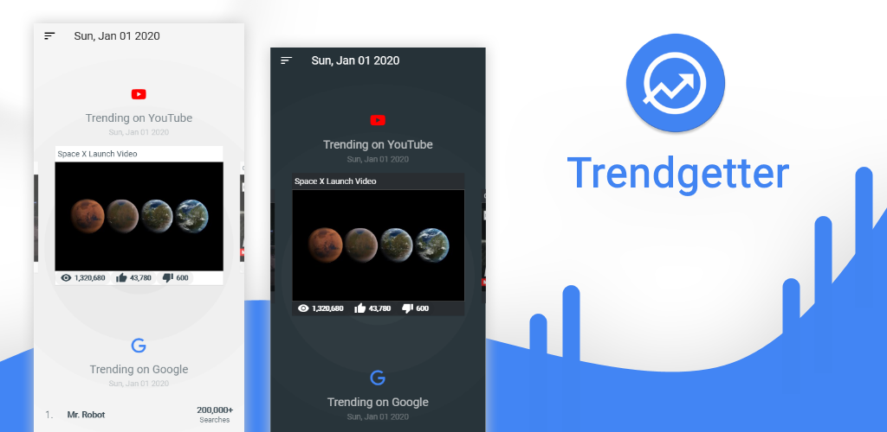

# Trendgetter

### Available on iOS, Android and Web!

---

> Trendgetter gets trending content from various sites: YouTube, Google, Twitter, Reddit, Snapchat and GitHub,  
> Keeping you informed of everything that's going on in the world.

---

## Features

- Design

  - Material design components.
  - Navigation drawer for fast and easy navigation.
  - Smooth page transitions.
  - Beautiful splash screen and icons.
  - Intuitive and appealing carousels.

- Pages

  - Personalized home page.
  - YouTube videos page.
  - Google searches page.
  - Twitter hashtags page.
  - Reddit posts page.
  - GitHub repositories page.
  - Snapchat stories page.
  - Snapchat story viewer.

- Preferences

  - Customizable home layout.
  - Adaptive theme based on OS preference.
  - Rich theme selector.
  - Customizable page colors.

- App

  - Stunning about screen.
  - Persistent storage.
  - Multi-window support.

---

### Donate

Help me improve this project! Any amount is much appreciated :)

---

## License

> Copyright (C) 2020-present Zivsteve.  
> Licensed under the [MIT](https://opensource.org/licenses/MIT) license.  
> (See the [LICENSE](https://github.com/Zivsteve/trendgetter-api/blob/master/LICENSE) file for the whole license text.)
